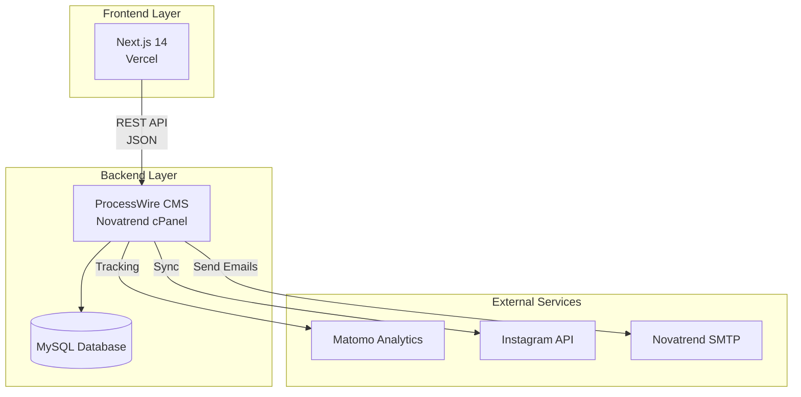
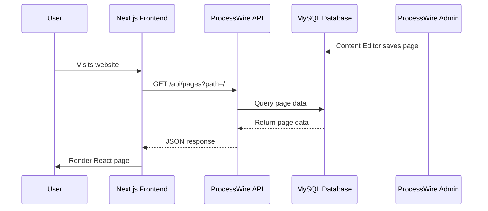

# bioco.ch Project Hand-off Documentation

**Version:** 1.0  
**Last Updated:** January 2026  
**Project:** bioco.ch Website for Gemüsegenossenschaft biocò

---

## Table of Contents

1. [Project Overview](#1-project-overview)
2. [ProcessWire CMS Fundamentals](#2-processwire-cms-fundamentals)
3. [Project Architecture](#3-project-architecture)
4. [Custom Modules](#4-custom-modules)
5. [API Endpoints](#5-api-endpoints)
6. [Frontend Architecture](#6-frontend-architecture)
7. [Configuration Files](#7-configuration-files)
8. [Design Choices & Rationale](#8-design-choices--rationale)
9. [For Web Administrators](#9-for-web-administrators)
10. [For Developers](#10-for-developers)
11. [Deployment Process](#11-deployment-process)
12. [Bioco Directory](#12-bioco-directory)
13. [Existing Documentation](#13-existing-documentation)
14. [Common Tasks & Troubleshooting](#14-common-tasks--troubleshooting)
15. [Security Considerations](#15-security-considerations)

---

## 1. Project Overview

### Purpose

The bioco.ch website serves as the digital presence for **Gemüsegenossenschaft biocò**, a Swiss organic vegetable cooperative (Solidarische Landwirtschaft / Community Supported Agriculture). The site enables:

- Content management for cooperative information
- Event management and registration (Schnuppertage)
- Newsletter subscriptions with double opt-in
- Member onboarding with payment slip generation
- Instagram feed integration for news updates
- Contact forms and waiting list management

### Technology Stack

- **Backend CMS:** ProcessWire 3.x (PHP 8.2)
- **Frontend:** Next.js 14 (React) with App Router
- **Database:** MySQL (3 databases: live, staging, matomo)
- **Hosting:**
  - Backend: Novatrend cPanel (Swiss hosting)
  - Frontend: Vercel (CDN, automatic deployments)
- **Analytics:** Matomo (cookieless, Swiss DSG compliant)
- **Email:** Novatrend SMTP server

### Deployment Environments

- **Staging:** `staging.bioco.ch` (develop branch)
- **Production:** `www.bioco.ch` (main branch)
- **Local Development:** `localhost:3000` (frontend), `localhost` (ProcessWire)

### Architecture Pattern

This project uses a **headless CMS architecture**:

- ProcessWire serves as a content API (no frontend rendering)
- Next.js consumes ProcessWire data via REST API
- Complete separation between content management and presentation
- Enables independent scaling and deployment of frontend/backend

---

## 2. ProcessWire CMS Fundamentals

### What is ProcessWire?

ProcessWire is an open-source PHP CMS/CMF (Content Management Framework) that provides:

- Flexible content modeling (no predefined content types)
- Powerful API for developers
- Clean admin interface for content editors
- Headless CMS capabilities (API-first)
- Strong security and performance

### Why ProcessWire?

1. **Flexibility:** No rigid content structures - create fields and templates as needed
2. **API-First:** Built-in API makes headless CMS integration straightforward
3. **Swiss DSG Compliance:** Can be configured for privacy-friendly operation
4. **Developer-Friendly:** Clean PHP codebase, excellent documentation
5. **Stability:** Mature platform (since 2003) with regular updates

### Core Concepts

#### Pages

Everything in ProcessWire is a **Page**. Pages are organized in a hierarchical tree structure:

```
/ (Home)
  /wir (About)
  /gemuese (Vegetables)
  /abos (Subscriptions)
  /aktuelles (News)
    /events (Events parent)
      /schnuppertag-28-04-2026 (Event page)
```

#### Templates

**Templates** define the structure and fields available for a page type:

- `home` - Homepage template
- `basic-page` - Standard content pages
- `event` - Event pages with date, location, media
- `form-*` - Form page templates

#### Fields

**Fields** store the actual content data:

- `title` - Page title (built-in)
- `body` - Main content (textarea)
- `hero_image` - Hero banner image
- `event_start` - Event start date/time
- `gallery_images` - Multiple images

#### Modules

**Modules** extend ProcessWire functionality:

- Core modules (built-in): LazyCron, WireMail, etc.
- Custom modules (this project): FormProcessor, DOIManager, etc.

### How ProcessWire Works in Headless Mode

In headless mode, ProcessWire doesn't render HTML. Instead:

1. Content editors use ProcessWire admin (`/processwire/`) to manage content
2. Custom API endpoints (`site/api/*.php`) expose content as JSON
3. Frontend (Next.js) fetches JSON via HTTP requests
4. Frontend renders the UI using React components

**Example Flow:**

```
Editor → ProcessWire Admin → Database
                              ↓
                         API Endpoint
                              ↓
                         JSON Response
                              ↓
                    Next.js Frontend
                              ↓
                         User Browser
```

### Admin Interface

Access ProcessWire admin at: `https://www.bioco.ch/processwire/`

**Key Admin Areas:**

- **Pages:** Content tree, create/edit pages
- **Setup → Fields:** Define content fields
- **Setup → Templates:** Define page templates
- **Modules:** Install/configure modules
- **Access → Users:** Manage user accounts and roles

### Key ProcessWire Files

| File | Purpose |
|------|---------|
| `index.php` | Entry point, bootstraps ProcessWire |
| `site/config.php` | Environment configuration (not in Git) |
| `site/ready.php` | Bootstrap file, initializes custom classes |
| `site/init.php` | Global hooks (optional) |
| `site/templates/` | Template files (not used in headless mode, but define structure) |
| `site/modules/` | Custom modules |
| `site/api/` | API endpoints |
| `wire/` | ProcessWire core (don't modify) |

---

## 3. Project Architecture

### System Architecture



### Data Flow



### File Structure

```
bioco-web-project/
├── site/                    # ProcessWire site files
│   ├── api/                 # API endpoints
│   │   ├── events.php
│   │   ├── forms.php
│   │   ├── pages.php
│   │   └── ...
│   ├── classes/            # PHP classes
│   │   └── EventSetup.php
│   ├── modules/            # Custom modules
│   │   ├── DOIManager/
│   │   ├── FormProcessor/
│   │   ├── InstagramSync/
│   │   ├── MatomoTracker/
│   │   └── ProcessNewsletter/
│   ├── templates/           # Template files
│   ├── config-example.php  # Config template
│   ├── ready.php           # Bootstrap
│   └── init.php            # Hooks
├── frontend/               # Next.js application
│   ├── app/                # App Router pages
│   ├── components/         # React components
│   └── package.json
├── wire/                   # ProcessWire core (don't modify)
├── docs/                   # Documentation
├── Bioco/                  # Design assets
└── HANDOFF.md              # This file
```

### Database Structure

ProcessWire manages its own database schema. Key tables:

- `pages` - All pages (content)
- `fields` - Field definitions
- `templates` - Template definitions
- `fieldgroups` - Field-to-template mappings
- `doi_tokens` - Double opt-in tokens (custom table)
- `newsletter_subscribers` - Newsletter subscriber list
- `newsletter_campaigns` - Campaign metadata and content
- `newsletter_send_queue` - Per-recipient send status

**Note:** Don't modify ProcessWire tables directly. Use the API or admin interface.

---

## 4. Custom Modules

All custom modules are located in `site/modules/`. Each module is a PHP class that extends ProcessWire's module system.

### DOIManager

**Location:** `site/modules/DOIManager/DOIManager.module.php`

**Purpose:** Manages double opt-in (DOI) email confirmation for newsletter subscriptions and form submissions.

**Key Features:**

- Generates secure tokens (24-hour expiration)
- Creates `doi_tokens` database table automatically
- Sends confirmation emails with token links
- Validates tokens and processes confirmations
- Tracks confirmation status and timestamps

**Usage:**

```php
$doiManager = $modules->get('DOIManager');
$result = $doiManager->initiateDOI($email, 'subscribe', $formData);
```

**Database Table:**

```sql
doi_tokens (
  id, token, email, form_type, form_data,
  created, expires, confirmed, confirmed_at
)
```

### FormProcessor

**Location:** `site/modules/FormProcessor/FormProcessor.module.php`

**Purpose:** Handles all form submissions with validation, storage, and email notifications.

**Supported Forms:**

- `contact` - Contact form
- `subscribe` - Newsletter subscription (triggers DOI)
- `visit` - Open visit day registration (Schnuppertag)
- `waiting-list` - Waiting list for full subscription slots
- `event-signup` - Event registration
- `membership` - New member onboarding (with payment slip)

**Key Features:**

- Input sanitization and validation
- Spam protection (honeypot fields)
- Email notifications to admins
- Form data stored in ProcessWire pages
- DOI integration for newsletter signups
- Swiss QR payment slip generation (membership)

**Configuration:**

Set in `site/config.php`:

```php
$config->admin_email = 'admin@bioco.ch';
$config->email_from = 'hallo@bioco.ch';
$config->email_from_name = 'Bioco';
```

### InstagramSync

**Location:** `site/modules/InstagramSync/InstagramSync.module.php`

**Purpose:** Synchronizes Instagram posts from @bioco_ch to the Aktuelles section.

**Key Features:**

- Daily sync via LazyCron (runs when site accessed after midnight)
- Creates/updates posts automatically
- Downloads images to ProcessWire assets
- Maps Instagram data to ProcessWire fields

**Configuration:**

```php
$config->instagram_access_token = 'YOUR_TOKEN';
$config->instagram_user_id = 'YOUR_USER_ID';
```

**Requirements:**

- Instagram Business Account
- Facebook App with Instagram Graph API access
- LazyCron module (ProcessWire core)

### MatomoTracker

**Location:** `site/modules/MatomoTracker/MatomoTracker.module.php`

**Purpose:** Provides cookieless analytics tracking compliant with Swiss DSG.

**Key Features:**

- Server-side event tracking
- Client-side tracking script generation
- Session-based event queue
- No cookies required (privacy-friendly)

**Configuration:**

```php
$config->matomo_enabled = true;
$config->matomo_url = 'https://matomo.bioco.ch/';
$config->matomo_site_id = 1; // 1 for staging, 2 for production
```

**Usage in Templates:**

```php
<?php if($modules->isInstalled('MatomoTracker')): ?>
    <?php $matomoTracker = $modules->get('MatomoTracker'); ?>
    <script>
        <?php echo $matomoTracker->getTrackingScript(); ?>
    </script>
<?php endif; ?>
```

### ProcessNewsletter

**Location:** `site/modules/ProcessNewsletter/ProcessNewsletter.module.php`

**Purpose:** In-house newsletter manager with campaign creation, batch sending, and subscriber management.

**Key Features:**

- DOI-backed subscriber list (uses DOIManager/FormProcessor flow)
- Draft and scheduled campaigns
- Page picker for Aktuelles (news_item) and upcoming events
- Content snapshotting (page edits don't change sent emails)
- LazyCron-based send queue with SMTP throttling
- Tokenized unsubscribe links
- List-Unsubscribe header for one-click unsubscribe
- Admin UI for campaigns and subscriber list

**Database Tables:**

```sql
newsletter_subscribers (id, email, name, status, source, unsubscribe_token, ...)
newsletter_campaigns (id, title, subject, preheader, status, scheduled_at, body_intro, content_blocks, ...)
newsletter_send_queue (id, campaign_id, subscriber_id, status, attempts, ...)
```

**Configuration (site/config.php):**

```php
$config->email_from = 'hallo@bioco.ch';
$config->email_from_name = 'Bioco';
$config->newsletter_batch_size = 50; // emails per 5-minute window
```

**Setup:** Run `php scripts/setup-newsletter.php` to install module, create unsubscribe template/page. See `docs/newsletter-setup.md` for full guide.

### EventSetup

**Location:** `site/classes/EventSetup.php` (not a module, but a bootstrap class)

**Purpose:** Manages event lifecycle, including automatic status changes and signup toggles.

**Key Features:**

- Creates event fields and template on bootstrap
- Daily automation via LazyCron (changes events to "past" status)
- Auto-disables signup forms for past events
- Supports media galleries (images/videos)

**Fields Created:**

| Field | Type | Purpose |
|-------|------|---------|
| `event_status` | Options | `upcoming` or `past` |
| `event_start` | DateTime | Event start time |
| `event_end` | DateTime | Event end time |
| `event_location` | Text | Location name |
| `event_summary` | Textarea | Short description for cards |
| `event_media` | File | Photos/videos |
| `event_signup_enabled` | Checkbox | Show/hide signup form |
| `event_signup_notes` | Textarea | Signup instructions |

**Initialization:**

Called in `site/ready.php`:

```php
require_once __DIR__ . '/classes/EventSetup.php';
(new EventSetup($wire))->bootstrap();
```

---

## 5. API Endpoints

All API endpoints are located in `site/api/` and return JSON. They're accessed via ProcessWire's URL routing.

### `/api/events`

**Method:** GET  
**Purpose:** Returns event feed (upcoming & past events)

**Response:**

```json
{
  "success": true,
  "generatedAt": "2026-01-27T10:00:00+01:00",
  "upcoming": [
    {
      "id": 1234,
      "title": "Schnuppertag",
      "description": "Kurzbeschreibung",
      "fullDescription": "<p>Vollständige Beschreibung</p>",
      "location": "Geisshof",
      "startDate": "2026-04-28T12:00:00Z",
      "endDate": "2026-04-28T15:00:00Z",
      "dateLabel": "28.04.2026",
      "timeLabel": "14:00 - 17:00 Uhr",
      "signupEnabled": true,
      "signupNotes": "Treffpunkt 13:45",
      "status": "upcoming",
      "media": [],
      "url": "https://www.bioco.ch/events/..."
    }
  ],
  "past": [...]
}
```

### `/api/forms`

**Method:** POST  
**Purpose:** Handles form submissions

**Supported Types:**

- `/api/forms/contact`
- `/api/forms/subscribe`
- `/api/forms/visit`
- `/api/forms/waiting-list`
- `/api/forms/membership`

**Request Body:**

```json
{
  "name": "Max Mustermann",
  "email": "max@example.com",
  "message": "Hello..."
}
```

**Response:**

```json
{
  "success": true
}
```

### `/api/doi`

**Method:** GET  
**Purpose:** Confirms double opt-in token

**Query Parameters:**

- `token` - DOI token from email

**Response:**

```json
{
  "success": true,
  "message": "Bestätigung erfolgreich"
}
```

### `/api/instagram`

**Method:** GET  
**Purpose:** Returns Instagram posts feed

**Response:**

```json
{
  "success": true,
  "posts": [
    {
      "id": "123456789",
      "caption": "Post caption...",
      "media_url": "https://...",
      "permalink": "https://instagram.com/p/...",
      "timestamp": "2026-01-27T10:00:00Z"
    }
  ]
}
```

### `/api/navigation`

**Method:** GET  
**Purpose:** Returns site navigation structure

**Response:**

```json
{
  "success": true,
  "navigation": [
    {
      "title": "Wir",
      "url": "/wir",
      "children": []
    }
  ]
}
```

### `/api/pages`

**Method:** GET  
**Purpose:** Returns page content

**Query Parameters:**

- `path` - Page path (e.g., `/`, `/wir`)

**Response:**

```json
{
  "id": 1001,
  "title": "Home",
  "url": "/",
  "body": "<p>Content...</p>",
  "hero_image": {
    "url": "https://...",
    "description": "Hero image"
  }
}
```

### API Security

- All endpoints validate and sanitize inputs
- CORS headers configured for Vercel domains
- API tokens required for write operations (if implemented)
- Input sanitization via ProcessWire's Sanitizer

---

## 6. Frontend Architecture

### Next.js Structure

The frontend is a Next.js 14 application using the App Router:

```
frontend/
├── app/                    # App Router pages
│   ├── page.tsx           # Homepage
│   ├── aktuelles/         # News page
│   ├── api/               # API routes (proxies to ProcessWire)
│   └── ...
├── components/            # React components
│   ├── forms/             # Form components
│   ├── events/             # Event components
│   └── ...
├── lib/                   # Utilities
│   └── email.ts           # Email sending
└── package.json
```

### API Integration

Frontend fetches data from ProcessWire API:

```typescript
// Example: Fetch events
const response = await fetch(`${process.env.NEXT_PUBLIC_PROCESSWIRE_API_URL}/events`);
const data = await response.json();
```

### Rendering Strategies

**Static Generation (SSG):**

- Homepage (`/`)
- Content pages (`/wir`, `/gemuese`, etc.)
- Generated at build time

**Incremental Static Regeneration (ISR):**

- `/aktuelles` - Revalidates every 5 minutes
- Events data cached with `revalidate: 300`

**Server-Side Rendering (SSR):**

- Dynamic pages that need real-time data

### Environment Variables

**Required (Vercel Dashboard):**

```bash
# ProcessWire API
NEXT_PUBLIC_PROCESSWIRE_API_URL=https://www.bioco.ch/api
PROCESSWIRE_API_URL=https://www.bioco.ch/api

# Site
NEXT_PUBLIC_SITE_URL=https://www.bioco.ch

# Matomo
NEXT_PUBLIC_MATOMO_URL=https://matomo.bioco.ch/
NEXT_PUBLIC_MATOMO_SITE_ID=2

# Email (SMTP)
SMTP_HOST=mail.bioco.ch
SMTP_PORT=465
SMTP_SECURE=true
SMTP_USER=hallo@bioco.ch
SMTP_PASS=...
```

**Note:** Variables prefixed with `NEXT_PUBLIC_` are exposed to the browser.

### Build Process

```bash
cd frontend
npm install
npm run build
```

Vercel automatically:
1. Detects Next.js project
2. Runs `npm install`
3. Runs `npm run build`
4. Deploys to CDN

---

## 7. Configuration Files

### `site/config.php`

**Status:** NOT in Git (ignored by `.gitignore`)  
**Purpose:** Environment-specific configuration

**Required Settings:**

```php
<?php namespace ProcessWire;

// Database
$config->dbHost = 'localhost';
$config->dbName = 'bioco_live'; // or bioco_staging
$config->dbUser = 'bioco_YOURUSERNAME';
$config->dbPass = 'YOUR_PASSWORD';

// Site URLs
$config->httpHost = 'www.bioco.ch'; // or staging.bioco.ch
$config->urls->root = '/';

// Email
$config->email_from = 'hallo@bioco.ch';
$config->email_from_name = 'Bioco';
$config->admin_email = 'admin@bioco.ch';
$config->info_email = 'info@bioco.ch';
$config->intranet_email = 'intranet@bioco.ch';

// Matomo
$config->matomo_enabled = true;
$config->matomo_url = 'https://matomo.bioco.ch/';
$config->matomo_site_id = 2; // 1 for staging, 2 for production

// Security
$config->userAuthSalt = 'GENERATE_RANDOM_STRING';
$config->tableSalt = 'GENERATE_RANDOM_STRING';
$config->debug = false; // true for staging
```

**Template:** See `site/config-example.php`

### `site/ready.php`

**Purpose:** Bootstrap file that initializes custom classes

**Content:**

```php
<?php namespace ProcessWire;

require_once __DIR__ . '/classes/EventSetup.php';
(new EventSetup($wire))->bootstrap();
```

**When it runs:** After ProcessWire core loads, before page rendering

### `site/init.php`

**Purpose:** Global initialization hooks (optional)

**Current content:** Empty (can be used for global hooks)

**Example usage:**

```php
$wire->addHookAfter('Page::render', function($event) {
    // Modify output
});
```

### `.htaccess`

**Location:** Root of ProcessWire installation

**Key Requirements:**

```apache
# Force PHP 8.2
<IfModule mime_module>
  AddHandler application/x-httpd-ea-php82 .php
</IfModule>

# ProcessWire URL rewriting
RewriteEngine On
RewriteBase /
RewriteCond %{REQUEST_FILENAME} !-f
RewriteCond %{REQUEST_FILENAME} !-d
RewriteRule ^(.*)$ index.php?it=$1 [L,QSA]

# Security headers
Header set X-Content-Type-Options "nosniff"
Header set X-Frame-Options "SAMEORIGIN"
```

---

## 8. Design Choices & Rationale

### Why Headless CMS?

**Separation of Concerns:**

- Content management (ProcessWire) independent from presentation (Next.js)
- Content editors don't need to know React
- Frontend developers don't need to know ProcessWire templates

**Performance:**

- Static site generation (SSG) for fast page loads
- CDN distribution via Vercel
- API caching strategies

**Flexibility:**

- Easy to change frontend framework (if needed)
- Multiple frontends can consume same API
- Mobile app could use same API

### Why ProcessWire?

**Flexibility:**

- No rigid content models
- Create fields and templates as needed
- Easy to extend with custom modules

**API-First:**

- Built-in API capabilities
- JSON responses out of the box
- Easy to consume from any frontend

**Swiss DSG Compliance:**

- Can be configured for privacy-friendly operation
- No tracking cookies required
- Full control over data processing

**Developer Experience:**

- Clean PHP codebase
- Excellent documentation
- Active community

### Why Next.js?

**React Ecosystem:**

- Modern React features
- Large component library ecosystem
- Developer familiarity

**SSR/SSG:**

- Server-side rendering for SEO
- Static generation for performance
- Incremental static regeneration for freshness

**Vercel Integration:**

- Seamless deployment
- Automatic SSL
- Global CDN

### Why Matomo?

**Privacy-Friendly:**

- Cookieless tracking (Swiss DSG compliant)
- Self-hosted (data stays in Switzerland)
- No cookie banner required

**Features:**

- Pageview tracking
- Event tracking
- Custom dashboards

### Email System: Novatrend SMTP

**Why Novatrend SMTP:**

- Swiss hosting provider (data sovereignty)
- Reliable delivery
- No third-party email service dependencies
- Direct integration with domain

**Configuration:**

See `docs/form-email-setup.md` for detailed setup.

---

## 9. For Web Administrators

This section is for content editors and site administrators who manage content but don't write code.

### Accessing ProcessWire Admin

**URL:** `https://www.bioco.ch/processwire/`

**Login:** Use your admin credentials (contact technical administrator if you don't have access)

### Content Editing Workflows

#### Editing a Page

1. Navigate to **Pages** in admin menu
2. Find page in content tree
3. Click page title to edit
4. Modify content fields
5. Click **Save** or **Save + Publish**

#### Adding a New Page

1. Navigate to **Pages**
2. Select parent page where new page should appear
3. Click **New** button
4. Select template (e.g., `basic-page`)
5. Fill in title and content
6. Click **Save**

#### Uploading Images

1. Edit page
2. Click on image field (e.g., "Hero Image")
3. Click **Choose Files**
4. Select image from computer
5. Add description (alt text) for accessibility
6. Click **Insert**

### Event Management

#### Creating a New Event

1. Navigate to **Pages** → **Events**
2. Click **New**
3. Select template: `event`
4. Fill in fields:
   - **Title:** "Schnuppertag"
   - **Status:** "Bevorstehend" (upcoming)
   - **Start Date:** Select date and time
   - **End Date:** Select date and time
   - **Location:** "Geisshof"
   - **Summary:** Brief description (shown on cards)
   - **Body:** Full description (shown in modal)
5. Enable signup (if applicable):
   - Check "Anmeldeformular anzeigen"
   - Add signup notes (optional)
6. Click **Save**

#### Adding Event Media

1. Edit event page
2. Scroll to "Fotos & Videos" field
3. Upload images/videos
4. Add descriptions
5. Click **Save**

**Note:** Events automatically change to "past" status after end date (via EventSetup automation)

### Form Submission Review

Form submissions are stored as ProcessWire pages:

1. Navigate to **Pages**
2. Look for form submission pages (location depends on FormProcessor configuration)
3. Review submission data
4. Take action (respond, mark as processed, etc.)

### User Roles and Permissions

**Available Roles:**

- `superuser` - Full admin access (can manage everything)
- `admin` - Admin access (cannot manage modules)
- `redaktion` - Editor role (content only, no settings)

**Managing Users:**

1. Navigate to **Access** → **Users**
2. Click **New** to add user
3. Assign role
4. Set password
5. Click **Save**

### Media Management

**Uploading Files:**

1. Navigate to **Pages** → **Files** (or via page edit)
2. Click **Upload**
3. Select files
4. Add descriptions/alt text
5. Files are stored in `site/assets/files/`

**File Organization:**

- Files are organized by page
- Each page has its own file directory
- Images are automatically resized (if configured)

### Common Admin Tasks

**Changing Site Logo:**

1. Edit homepage (`/`)
2. Find "Logo Image" field
3. Upload new logo (SVG or PNG)
4. Save

**Updating Navigation:**

Navigation is automatically generated from page structure. To change order:

1. Navigate to **Pages**
2. Drag and drop pages to reorder
3. Changes reflect in navigation automatically

**Viewing Logs:**

1. Navigate to **Setup** → **Logs**
2. Select log file (e.g., "errors", "events-automation")
3. Review entries

---

## 10. For Developers

This section is for developers who will maintain or extend the codebase.

### Custom Modules Location

All custom modules are in `site/modules/`:

```
site/modules/
├── DOIManager/
│   └── DOIManager.module.php
├── FormProcessor/
│   └── FormProcessor.module.php
├── InstagramSync/
│   └── InstagramSync.module.php
├── MatomoTracker/
│   └── MatomoTracker.module.php
└── ProcessNewsletter/
    └── ProcessNewsletter.module.php
```

### Module Structure

**Basic Module Template:**

```php
<?php namespace ProcessWire;

class MyModule extends WireData implements Module {
    
    public static function getModuleInfo() {
        return [
            'title' => 'My Module',
            'version' => 1,
            'summary' => 'Module description',
            'autoload' => true, // Auto-load on every request
        ];
    }
    
    public function init() {
        // Module initialization
    }
}
```

**Installing a Module:**

1. Place module in `site/modules/MyModule/MyModule.module.php`
2. Go to ProcessWire admin → **Modules**
3. Click **Refresh**
4. Find module in list
5. Click **Install**

### API Endpoint Development

**Creating a New Endpoint:**

1. Create file in `site/api/myendpoint.php`:

```php
<?php namespace ProcessWire;

header('Content-Type: application/json');
header('Access-Control-Allow-Origin: *');

$pages = wire('pages');

$response = [
    'success' => true,
    'data' => []
];

// Your logic here

echo json_encode($response);
```

2. Access via: `https://www.bioco.ch/api/myendpoint`

**URL Routing:**

ProcessWire routes `/api/*` to `site/api/*.php` files automatically via `.htaccess` or URL segments.

### Frontend Component Structure

**Location:** `frontend/components/`

**Example Component:**

```typescript
// frontend/components/EventCard.tsx
export default function EventCard({ event }) {
  return (
    <div className="event-card">
      <h3>{event.title}</h3>
      <p>{event.description}</p>
    </div>
  );
}
```

### Database Schema

ProcessWire manages its own schema. Don't modify tables directly.

**Custom Tables:**

- `doi_tokens` - Created by DOIManager module
- `newsletter_subscribers` - Created by ProcessNewsletter module
- `newsletter_campaigns` - Created by ProcessNewsletter module
- `newsletter_send_queue` - Created by ProcessNewsletter module

**Querying Data:**

```php
// In ProcessWire
$pages = wire('pages');
$events = $pages->find('template=event, event_status=upcoming');
```

### Git Workflow

**Branches:**

- `develop` → `staging.bioco.ch` (testing)
- `main` → `www.bioco.ch` (production)

**Workflow:**

1. Create feature branch: `git checkout -b feature/my-feature`
2. Make changes
3. Commit: `git commit -m "Add feature"`
4. Push: `git push origin feature/my-feature`
5. Merge to `develop` for staging testing
6. Merge to `main` for production deployment

**Never commit:**

- `site/config.php` (contains secrets)
- `site/assets/files/` (user uploads)
- `node_modules/` (dependencies)

### Development Setup

**Backend (ProcessWire):**

1. Clone repository
2. Copy `site/config-example.php` to `site/config.php`
3. Configure database in `site/config.php`
4. Access `http://localhost` to run ProcessWire installer
5. Install custom modules via admin

**Frontend (Next.js):**

1. `cd frontend`
2. `npm install`
3. Create `.env.local` with API URLs
4. `npm run dev`
5. Access `http://localhost:3000`

### Debugging

**ProcessWire Logs:**

- Location: `site/assets/logs/`
- View in admin: **Setup** → **Logs**
- Or check files directly: `site/assets/logs/errors.txt`

**PHP Errors:**

- Enable debug mode: `$config->debug = true;` in `site/config.php`
- Errors display on screen (development only)

**Frontend Logs:**

- Browser console (F12)
- Vercel dashboard → Logs (production)

---

## 11. Deployment Process

### Git-Based Deployment

The project uses Git for all deployments:

- **Backend:** cPanel Git Version Control
- **Frontend:** Vercel (automatic from Git)

### Staging Workflow

1. **Develop on feature branch:**
   ```bash
   git checkout -b feature/my-feature
   # Make changes
   git commit -m "Add feature"
   git push origin feature/my-feature
   ```

2. **Merge to develop:**
   ```bash
   git checkout develop
   git merge feature/my-feature
   git push origin develop
   ```

3. **Deploy to staging:**
   - Backend: cPanel → Git → Update from Remote (develop branch)
   - Frontend: Vercel auto-deploys develop branch

4. **Test on staging.bioco.ch**

### Production Workflow

1. **Merge to main:**
   ```bash
   git checkout main
   git merge develop
   git push origin main
   ```

2. **Deploy to production:**
   - Backend: cPanel → Git → Update from Remote (main branch)
   - Frontend: Vercel auto-deploys main branch

3. **Verify on www.bioco.ch**

### Environment Variables Setup

**Backend (ProcessWire):**

Set in `site/config.php` on server (not in Git):

- Database credentials
- Email settings
- Matomo configuration
- Instagram API tokens

**Frontend (Vercel):**

Set in Vercel Dashboard → Settings → Environment Variables:

- `NEXT_PUBLIC_PROCESSWIRE_API_URL`
- `PROCESSWIRE_API_URL`
- `NEXT_PUBLIC_MATOMO_URL`
- `NEXT_PUBLIC_MATOMO_SITE_ID`
- SMTP credentials

**Scopes:**

- **Production:** Only `main` branch
- **Preview:** All other branches (staging, feature branches)

### Database Migration

**Exporting Database:**

1. cPanel → phpMyAdmin
2. Select database (`bioco_staging` or `bioco_live`)
3. Export → Custom → SQL format
4. Download SQL file

**Importing Database:**

1. cPanel → phpMyAdmin
2. Select target database
3. Import → Choose SQL file
4. Execute

**Important:** Update URLs in database after import:

```sql
UPDATE pages SET name = REPLACE(name, 'staging.bioco.ch', 'www.bioco.ch');
```

### File Permissions

**Required Permissions:**

- Directories: `755` (rwxr-xr-x)
- PHP files: `644` (rw-r--r--)
- `.htaccess`: `644`

**Setting Permissions (cPanel File Manager):**

1. Right-click file/folder
2. Select "Change Permissions"
3. Set numeric value
4. Apply

### Rollback Procedures

**Frontend (Vercel):**

1. Vercel Dashboard → Deployments
2. Find previous deployment
3. Click "⋯" → "Promote to Production"

**Backend (ProcessWire):**

1. Restore database backup
2. Revert Git commit:
   ```bash
   git reset --hard <previous-commit-hash>
   ```
3. Push to server

**See:** `docs/processwire-migration.md` for detailed rollback procedures

---

## 12. Bioco Directory

The `Bioco/` directory contains design assets, mockups, and project planning materials.

### Structure

```
Bioco/
├── bioco_mockups/          # HTML mockups of design concepts
│   ├── 01_swiss_grid.html
│   ├── 02_bauhaus_plakat.html
│   └── ...
├── Layout:Design/           # Design files and sitemaps
│   ├── Designvorschlaege/  # Design proposals (PNG images)
│   ├── Desingideen/        # Design ideas (PNG images)
│   └── sitemap*.html       # Sitemap variations
├── User Story Map/          # User journey and content planning
│   └── workshop-map*.html  # Interactive story maps
├── Bioco_28102025.pptx     # Presentation slides
└── Rückmeldungsrunde_*.pdf # Feedback rounds
```

### Purpose

- **Design Mockups:** Visual design concepts explored during project planning
- **User Story Maps:** Content strategy and user journey planning
- **Presentations:** Project presentations to stakeholders
- **Feedback Documents:** Client feedback and iterations

### For Future Reference

These files document the design process and can be useful for:

- Understanding design decisions
- Reference for future redesigns
- Content strategy planning
- Stakeholder communication

---

## 13. Existing Documentation

This project has extensive documentation in the root directory. This hand-off document provides an overview; refer to these documents for detailed procedures.

### `MATOMO_SETUP_DE.md` (Deutsch)

**Matomo Analytics Einrichtung** (vollständige Anleitung auf Deutsch):

- Matomo-Instanz Installation auf cPanel
- Datenschutz-Konfiguration (DSG-konform)
- ProcessWire MatomoTracker Modul Setup
- Next.js Frontend-Integration
- Testing & Verifizierung
- Fehlerbehebung & Wartung

**Verwenden für:** Matomo-Installation, Datenschutz-Setup, Tracking-Konfiguration

### `MATOMO_SETUP.md` (English)

**Matomo Analytics Setup Guide** (complete English documentation):

- Matomo instance installation
- Privacy settings (Swiss DSG compliant)
- ProcessWire backend configuration
- Next.js frontend integration
- Testing & troubleshooting
- Maintenance procedures

**Use this for:** Matomo setup, privacy configuration, tracking implementation

### `docs/processwire-migration.md`

**Comprehensive deployment guide** covering:

- Complete migration checklists (staging & production)
- Database migration procedures
- File transfer processes
- Member onboarding workflow
- Event management system details
- Rollback procedures
- Monitoring & maintenance

**Use this for:** Full deployment procedures, detailed technical setup

### `docs/form-email-setup.md`

**Email configuration guide** covering:

- Novatrend SMTP setup
- Email recipient configuration
- Form type to recipient mapping
- Safety features (BCC, logging)
- Troubleshooting email delivery

**Use this for:** Email system configuration and debugging

### `docs/fail-safe-improvements.md`

**System improvements documentation** covering:

- Signup form logic fixes
- API configuration & fallbacks
- Error handling improvements
- Frontend resilience patterns

**Use this for:** Understanding system reliability features

### `VERCEL_DEPLOYMENT.md`

**Frontend deployment guide** covering:

- Vercel configuration
- Build settings
- Environment variables
- Domain setup

**Use this for:** Frontend deployment and Vercel configuration

### `NEXTJS_SETUP.md`

**Frontend setup guide** covering:

- Next.js architecture
- API integration patterns
- Development setup
- Build process

**Use this for:** Frontend development and setup

### Additional Docs

- `docs/aws-ses-emails-recovery.md` - Email recovery procedures
- `docs/mx-records-migration.md` - DNS migration guide
- `docs/recover-emails-last-14-days.md` - Email recovery
- `docs/newsletter-setup.md` - In-house newsletter (ProcessNewsletter) setup, SMTP, cron, sending workflow
- `seo-implementation-spec.md` - SEO requirements and implementation

---

## 14. Common Tasks & Troubleshooting

### Adding a New Content Page

1. **ProcessWire Admin:**
   - Pages → Select parent → New
   - Choose template: `basic-page`
   - Fill in title and content
   - Save

2. **Frontend:**
   - Page automatically appears in navigation
   - Accessible at `/page-name` (URL based on page name)

### Creating a New Event

1. ProcessWire Admin → Pages → Events → New
2. Template: `event`
3. Fill in all required fields (see [Event Management](#event-management))
4. Save
5. Event appears in `/api/events` automatically
6. Frontend displays event on homepage and `/aktuelles`

### Debugging Form Submissions

**Check ProcessWire Logs:**

1. Admin → Setup → Logs
2. Look for form-related errors

**Check Email Delivery:**

1. Verify SMTP settings in `site/config.php`
2. Check Novatrend email account
3. Review `docs/form-email-setup.md`

**Test Form:**

1. Submit test form on staging
2. Check email inbox
3. Verify form data in ProcessWire admin

### Checking Email Delivery

**SMTP Configuration:**

- Verify settings in `site/config.php`
- Check Novatrend cPanel → Email Accounts
- Test SMTP connection

**Email Logs:**

- ProcessWire logs: `site/assets/logs/`
- Check for email send errors

**BCC Safety:**

- All emails are BCC'd to `info@bioco.ch`
- Check this inbox if primary recipient doesn't receive email

### Monitoring API Endpoints

**Test Endpoints:**

```bash
# Events
curl https://www.bioco.ch/api/events

# Pages
curl https://www.bioco.ch/api/pages?path=/

# Navigation
curl https://www.bioco.ch/api/navigation
```

**Check Response:**

- Should return JSON
- Status code should be 200
- Check for error messages in response

### Viewing Logs

**ProcessWire Logs:**

1. Admin → Setup → Logs
2. Or check files: `site/assets/logs/`

**Common Log Files:**

- `errors.txt` - PHP errors
- `events-automation.txt` - Event status changes
- `instagram-sync.txt` - Instagram sync activity

**Frontend Logs:**

- Browser console (F12) for client-side
- Vercel Dashboard → Logs for server-side

### Common Issues

**Issue: API returns 404**

- Check `.htaccess` URL rewriting rules
- Verify API file exists in `site/api/`
- Check ProcessWire URL segments configuration

**Issue: Forms not submitting**

- Check browser console for JavaScript errors
- Verify API endpoint is accessible
- Check ProcessWire logs for server errors

**Issue: Events not updating status**

- Check LazyCron is running (admin → Setup → Logs → LazyCron)
- Verify EventSetup bootstrap in `site/ready.php`
- Manually trigger: Visit site after midnight

**Issue: Images not loading**

- Check file permissions (`755` for directories, `644` for files)
- Verify images uploaded to correct page
- Check `site/assets/files/` directory exists

---

## 15. Security Considerations

### File Permissions

**Correct Permissions:**

- Directories: `755` (rwxr-xr-x)
- PHP files: `644` (rw-r--r--)
- `.htaccess`: `644`

**Never use `777`** except temporarily during ProcessWire installation.

### API Security

**Input Validation:**

- All API endpoints sanitize inputs using ProcessWire's Sanitizer
- Never trust user input
- Validate all form data

**CORS Headers:**

- Configured to allow requests only from Vercel domains
- Prevents unauthorized API access

**Rate Limiting:**

- Consider implementing for production (prevent abuse)
- Currently not implemented (can be added if needed)

### Database Credentials

**Storage:**

- Database credentials stored in `site/config.php`
- File is NOT in Git (ignored by `.gitignore`)
- Never commit `site/config.php` to repository

**Access:**

- Database user has minimal privileges (only on bioco_* databases)
- Use strong passwords (20+ characters, random)

### Environment Variables

**Frontend (Vercel):**

- Server-side variables (not prefixed with `NEXT_PUBLIC_`) are secure
- Client-side variables (`NEXT_PUBLIC_*`) are exposed to browser
- Never put secrets in `NEXT_PUBLIC_*` variables

**Backend (ProcessWire):**

- All secrets in `site/config.php` (not in Git)
- Never commit configuration with real credentials

### SSL Certificates

**Automatic Provisioning:**

- Vercel: Automatic SSL via Let's Encrypt
- cPanel: Automatic SSL via Let's Encrypt

**Verification:**

- Check certificate validity in browser (padlock icon)
- Certificates auto-renew (no manual intervention needed)

### ProcessWire Admin

**Security Best Practices:**

- **Strong Passwords:** 16+ characters, mixed case, numbers, symbols
- **Admin URL:** Consider renaming `/processwire/` to obscure path (optional)
- **User Roles:** Use `redaktion` role for editors (limited permissions)
- **Two-Factor Authentication:** Enable if available (via module)

**Access Control:**

- Limit admin access to trusted users only
- Regularly review user accounts
- Remove unused accounts

### .gitignore Configuration

**Critical Files Ignored:**

```
/site/config.php          # Contains database credentials
/site/assets/files/        # User uploads (large files)
/site/assets/cache/        # Cache files
/site/assets/logs/         # Log files
/node_modules/             # Dependencies
```

**Why:**

- Prevents committing secrets to Git
- Keeps repository size manageable
- Protects sensitive data

---

## Quick Reference

### Important URLs

- **Production Site:** https://www.bioco.ch
- **Staging Site:** https://staging.bioco.ch
- **ProcessWire Admin:** https://www.bioco.ch/processwire/
- **Vercel Dashboard:** https://vercel.com/dashboard
- **Matomo Analytics:** https://matomo.bioco.ch/

### Key File Locations

- **ProcessWire Config:** `site/config.php` (not in Git)
- **API Endpoints:** `site/api/*.php`
- **Custom Modules:** `site/modules/*/`
- **Bootstrap:** `site/ready.php`
- **Frontend:** `frontend/`

### Common Commands

```bash
# Frontend development
cd frontend && npm run dev

# Frontend build
cd frontend && npm run build

# Git workflow
git checkout develop
git merge feature/my-feature
git push origin develop
```

### Support Contacts

- **Technical Issues:** Contact development team
- **Content Questions:** Contact content administrator
- **Hosting Issues:** Contact Novatrend support
- **Vercel Issues:** Contact Vercel support

---

## Document Maintenance

**Keeping This Document Updated:**

- Update when architecture changes
- Add new modules/endpoints as they're created
- Document new workflows
- Update troubleshooting section with common issues

**Last Updated:** February 2026
**Version:** 1.1

---

**End of Hand-off Documentation**
